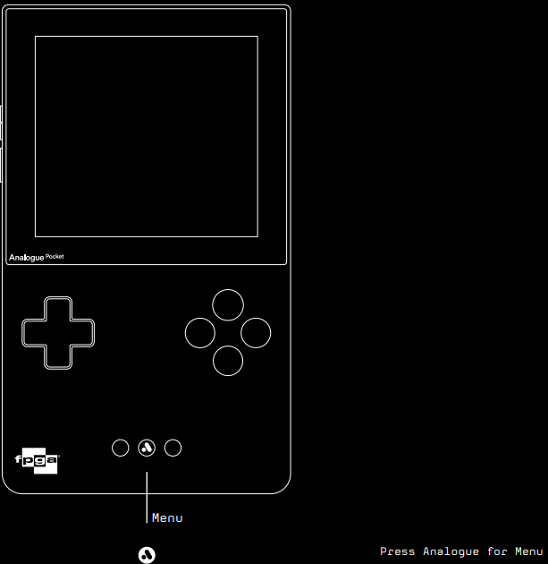

# Writeup: EPTboy
## Team: B00S
Author: xaos333

```
Can you defeat the imperialistic oil polluters and bring back the new republic?

Find a way to win the game, show off your skills in the gaming area and get the real flag.
```

**Unintended solve - EPTBoy**

The challenge EPTBoy was to beat a side-scrolling game on one of the onsite Analogue Pocket systems, essentially by going through the ROM's code (i.e. with an emulator), and finding a cheatcode. But there's also a cheesier way to get the flag. 



Between the Start and Select buttons, the Analogue Pocket system has a 3rd button, called "Analogue".
Pressing it brings the user to the Analogue menu, as seen in the image below.


Here, we can find the "Memories" section, which is just another name for "savestates". 


If while playing the game, the user holds down the DPAD-Up button along with the Analogue button, the system creates a save-state, which is then stored in the Memories tab.


If the player dies, entering the Memories tab in the Analogue menu and selecting the newest savestate brings the player back.
By saving a couple of times before crucial moments, it makes it extremely easy to beat the game. 


After doing this a couple of times (I used a total of 6 savestates), we get to the end of the game really quickly, and retrieve the flag: 
``EPT{EPT_BOY_MASTER}``

Who needs the Konami Code when you have savestates?
