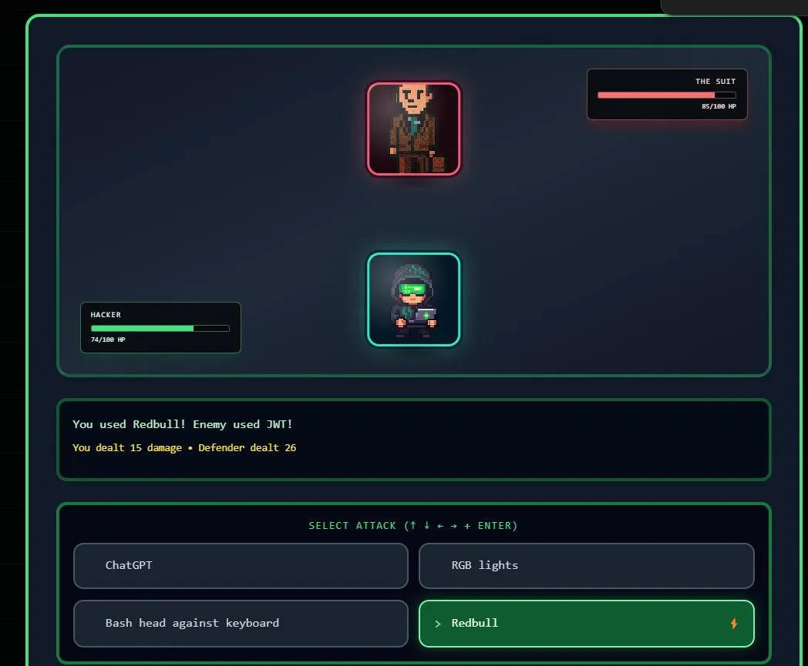
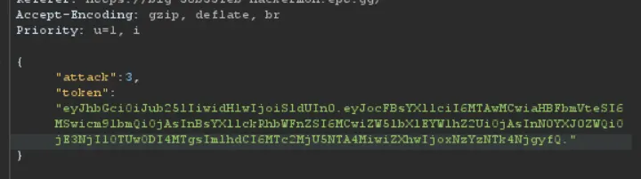
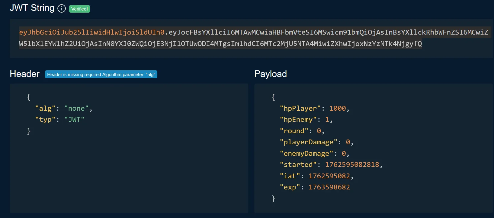

# Writeup: Hackermon
## Team: big🔥
**Author:** SpaceyLad (Stian Kvålshagen)

Open Burp Suite and use the proxy web browser. Let us analyze what is going on in this battle..
When performing an attack, I notice an attack value 3 and a token. At first glance, I mistook it for some sort of session token, until i put it into a JWT debugger.

You can try it yourself!
Website/tool: https://www.jwt.io/ 
Token: `eyJhbGciOiJub25lIiwidHlwIjoiSldUIn0.eyJocFBsYXllciI6MTAwMCwiaHBFbmVteSI6MSwicm91bmQiOjAsInBsYXllckRhbWFnZSI6MCwiZW5lbXlEYW1hZ2UiOjAsInN0YXJ0ZWQiOjE3NjI1OTUwODI4MTgsImlhdCI6MTc2MjU5NTA4MiwiZXhwIjoxNzYzNTk4NjgyfQ.`

Since there is no algorithm used to sign this, we are free to edit it as much as we want to! 😄

So to defeat this mighty hacker foe, I simply set the enemy health to 1 and my own characters health to 1000. I perform any attack and BAM! Enemy defeated :]

