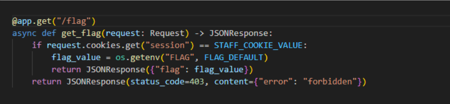
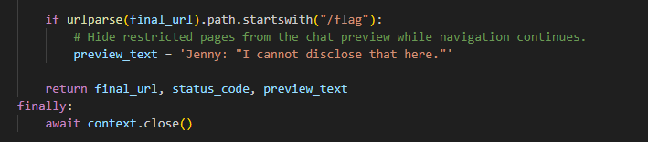
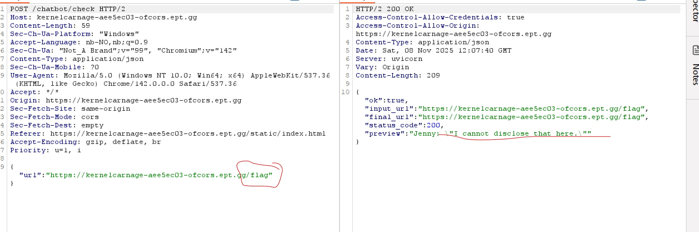
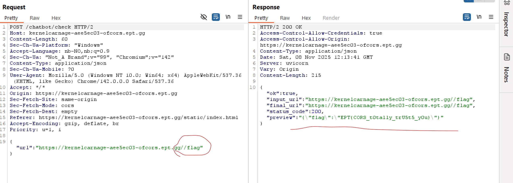

# Writeup: Of CORS I Can Help!
## Team: Kernel Carnage
**Author:** sSilverBack (Samatar Said Ahmed)

---

Before I started interacting with the application, I reviewed the available code and checked the page normally. During the code review, I immediately noticed an endpoint named **`/flag`**.

The initial request to the `/flag` endpoint showed a clear authorization check.

As the response indicated, I am not staff, and only Jenny is authorized to view the content. This required bypassing the authorization logic enforced by the code shown below.

This snippet confirmed that the server was checking for a specific session/role.

 

While examining the required path, I theorized that the server might be vulnerable to a path normalization issue.

I thought to myself: "The endpoint is `/flag`. What if I put an extra slash (`//flag`)? Will the server treat the double slash differently and bypass the authorization check for the specific endpoint?"

It actually worked! By requesting `//flag` instead of `/flag`, I successfully bypassed the check and received the flag.

**Flag:**
