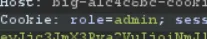

# Writeup: Secretadmin
## Team: big🔥
**Author:** SpaceyLad (Stian Kvålshagen)

Open Burp suite and explore the application through the proxy as usual.

Create any user. In my example, I simply used admin:admin

When browsing around I noticed this clear text role token..

I wonder what happened if I just.. change the user to ad.. and we are done! Short and sweet 😄

